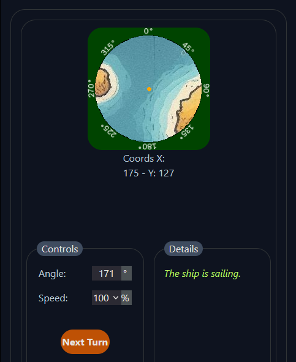

<a id="readme-top"></a>

---
<h1>DOCUMENTATION</h1>

---

<h2 align="center">Sailing System (demo)</h2>

<details>
    <summary>Table of Contents</summary>
    <ol>
        <li><a href="#about-the-project">About The Project</a></li>
        <ul><a href="#requirements">Requirements</a></ul>
        <ul>            
            <a href="#built-with">Built With</a>
        </ul>
        <li><a href="#getting-started">Getting Started</a></li>
        <li><a href="#usage">Usage</a></li>
        <li><a href="#the-system-explained">The System Explained</a></li>
        <li><a href="#license">License</a></li>
        <li><a href="#contact">Contact</a></li>
    </ol>
</details>

<!-- ABOUT THE PROJECT -->
## About the Project :boat:
---
<div align="center">
    
</div><br>

A very simple system that aims to emulate sailing or, in general temrs, *navigating*, in a 2D plane with some solid or otherwise unpassable abritrary polygonal shaped areas.
The core principes of this system and why not the code itself can be used on any web game where such a system or tool would be needed.

<p align="right">(<a href="#readme-top">back to top</a>)</p>

---

### Requirements:

* **PHP >=7.2**

>==**Important:**==
>This project makes use of the extension ***GDImage***, which as default comes as disabled. In order to make it work you will need to manually edit your **php.ini** and enable this extension.

<p align="right">(<a href="#readme-top">back to top</a>)</p>

---

### Built With

* 
    * 
* 
* 
* 
* 
* 


<p align="right">(<a href="#readme-top">back to top</a>)</p>

---

### Getting Started

Getting this working is quite simple. Once you got a copy of the repository the next thing is downloading all the dependencies, for which you would make use of a terminal.

First you're gonna stand on the root, then make use of **Composer** with the next command:
* composer:
```
composer install
```

This will install all the needed dependencies and create the *autoload*, which is required.

The next thing is to install all the **Node** dependencies.
* node
```
cd client
npm install
```

That's all.
Next thing is to start a PHP instance on the root with either **XAMPP/WAMPP** or your favorite web server package. You can also do it with a terminal.

Now just visit your localhost :).

<p align="right">(<a href="#readme-top">back to top</a>)</p>

---

### Usage

The system is quite simple: either click on the map pic to set the **angle** in relation with the dot (which represents the being/vehicle) or set it in the angle input. Set the **speed** using the dropdown, then press the ***Next Turn*** button. That's all.

The system stores no data at the back, only reads it. Any further implementation is up to you and it's absolutely possible to scale this.

<p align="right">(<a href="#readme-top">back to top</a>)</p>

---

### The System Explained

The sailing system consists of a back which is a very simple API made with Slim and custom classes, and a front which is a Svelte SPA.

As you the client connects to the API, it already comes with an initial pair of X:Y coords which are hardcoded at the front for ease of use. The back returns a picture representing the surroundings of the *being*.
As the *being* moves around and navigates it will stumble with chunks or masses of land. These chunks are polygonal shapes defined on the database, and each time the *being* does move the back checks if the arriving point ends inside any of those masses or in the perimeter. - If it does, the *being* is then placed right outside and its speed is reduced to 0. Further tries of going in the same direction will end in the same result.

For an ease of calculations, this system rounds any number to ***int***. There are no ***floats*** for coords.

<p align="right">(<a href="#readme-top">back to top</a>)</p>

---

### License

Distributed under the MIT License. See `LICENSE.txt` for more information.

<p align="right">(<a href="#readme-top">back to top</a>)</p>

---

### Contact

* 
* 

<p align="right">(<a href="#readme-top">back to top</a>)</p>